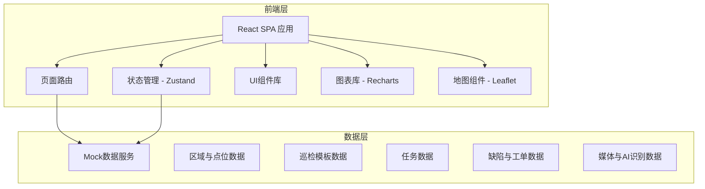
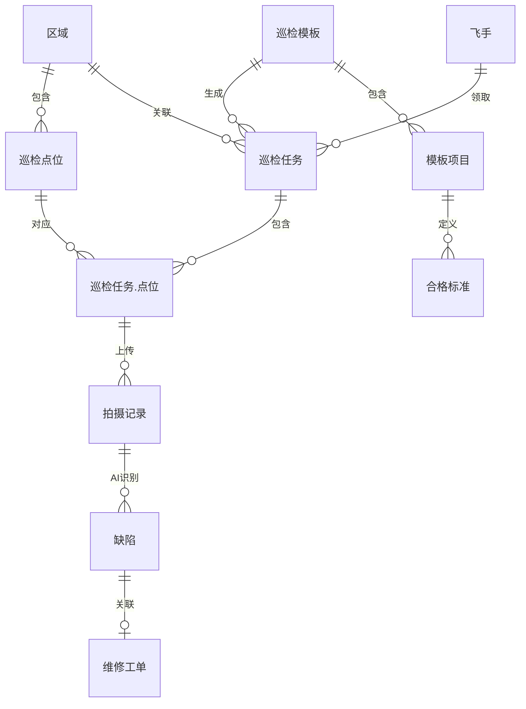

## 1. 架构设计



## 2. 技术说明

- 前端：React@18 + TypeScript + Tailwind CSS@3 + Vite
- 初始化工具：Vite (react-ts 模板)
- 后端：无（纯前端 + Mock数据）
- 数据库：无（使用本地 JSON Mock数据 + Zustand持久化）
- 地图：React-Leaflet（开源地图方案，无需API Key）
- 图表：Recharts
- 图标：Lucide React
- 动画：Framer Motion
- 日期：date-fns

## 3. 路由定义

| 路由 | 用途 |
|------|------|
| / | 工作台总览页 |
| /areas | 区域与点位管理 - 区域列表 |
| /areas/:id | 区域详情 - 点位列表与地图 |
| /templates | 巡检模板管理 - 模板列表 |
| /templates/:id | 模板编辑 - 拍摄项目与标准 |
| /tasks | 任务调度中心 - 任务列表 |
| /tasks/:id | 任务详情 - 路线与状态 |
| /inspection/:id | 巡检执行 - 拍摄与上传 |
| /defects | 缺陷与工单 - 缺陷列表 |
| /defects/:id | 缺陷详情 - 工单与闭环 |
| /analytics | 数据分析 - 统计与对比 |

## 4. API定义

无后端API，使用前端Mock数据层。数据接口通过Zustand Store提供：

```typescript
interface Area {
  id: string
  name: string
  type: 'power_line' | 'wind_farm' | 'pipeline' | 'other'
  description: string
  pointCount: number
  lastInspectionDate: string | null
  healthStatus: 'healthy' | 'warning' | 'critical'
  coordinates: [number, number]
}

interface InspectionPoint {
  id: string
  areaId: string
  name: string
  coordinates: [number, number]
  deviceType: string
  templateId: string
  lastInspectionDate: string | null
  status: 'normal' | 'attention' | 'abnormal'
}

interface InspectionTemplate {
  id: string
  name: string
  areaType: string
  version: string
  items: TemplateItem[]
  createdAt: string
  updatedAt: string
}

interface TemplateItem {
  id: string
  name: string
  description: string
  captureType: 'photo' | 'video'
  standards: Standard[]
  required: boolean
}

interface Standard {
  level: 'pass' | 'attention' | 'fail'
  description: string
  referenceImageUrl?: string
}

interface InspectionTask {
  id: string
  templateId: string
  areaId: string
  pilotId: string | null
  status: 'pending' | 'assigned' | 'in_progress' | 'completed' | 'overdue'
  scheduledDate: string
  completedDate: string | null
  points: TaskPoint[]
  route: [number, number][]
}

interface TaskPoint {
  pointId: string
  status: 'pending' | 'in_progress' | 'completed'
  captures: Capture[]
  completedAt: string | null
}

interface Capture {
  id: string
  type: 'photo' | 'video'
  url: string
  thumbnailUrl: string
  uploadedAt: string
}

interface Defect {
  id: string
  taskId: string
  pointId: string
  captureId: string
  type: 'crack' | 'rust' | 'foreign_object' | 'other'
  severity: 'low' | 'medium' | 'high' | 'critical'
  aiConfidence: number
  aiDescription: string
  pilotConfirmed: boolean
  pilotNote: string
  location: { x: number; y: number; width: number; height: number }
  workOrderId: string | null
  status: 'pending' | 'confirmed' | 'work_order_created' | 'repairing' | 'closed'
  createdAt: string
}

interface WorkOrder {
  id: string
  defectId: string
  assignee: string
  status: 'pending' | 'in_progress' | 'completed' | 'verified'
  description: string
  repairPhotos: string[]
  createdAt: string
  completedAt: string | null
  verifiedAt: string | null
}
```

## 5. 服务端架构图

不适用（纯前端项目）

## 6. 数据模型

### 6.1 数据模型定义



### 6.2 数据定义语言

不适用（使用前端Mock数据，无数据库表）
